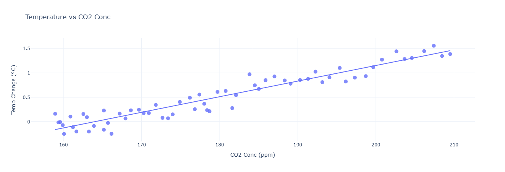
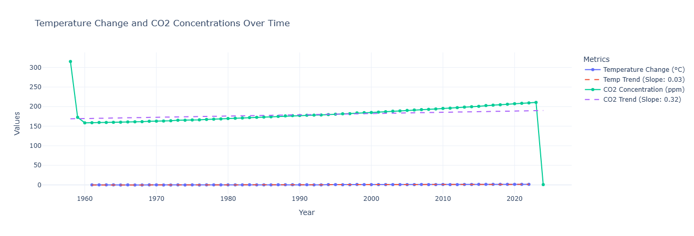
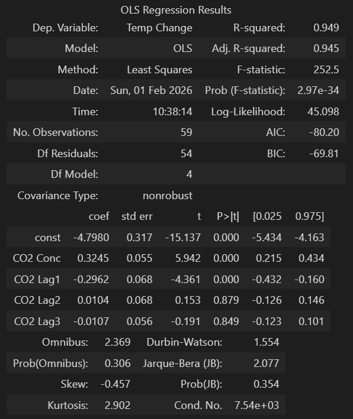
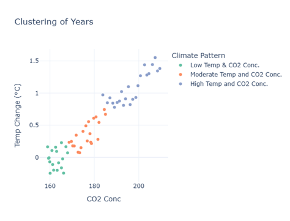
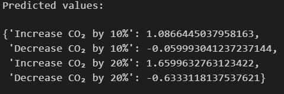

# 🌍 CO₂ Concentration and Global Temperature Analysis

## 📌 Project Overview

This project analyzes the relationship between atmospheric **CO₂ concentrations** and **global temperature changes** using statistical analysis and data visualization techniques. The goal is to understand long-term trends, correlations, and the potential impact of CO₂ variations on global warming.

The study combines descriptive statistics, time-series analysis, correlation analysis, regression modeling, clustering, and causality testing to provide a comprehensive view of how CO₂ levels and temperature anomalies are connected.

---

## 📊 Dataset Description

The dataset contains:

* **CO₂ concentration (ppm)** over time
* **Global temperature change (°C)** over the same period
The data spans multiple years, allowing both long-term trend analysis and seasonal pattern detection.

---

## 🔍 Key Findings

### 1. Descriptive Statistics

The mean temperature change is approximately 0.54°C, with a median of 0.47°C and a variance of 0.43, indicating slight variability in temperature anomalies. For CO₂ concentrations, the mean is 180.72 ppm, the median is significantly higher at 313.84 ppm, and the variance is 32,600, which reflects substantial variability in CO₂ levels over the dataset’s timeframe.

### 2. Time Series Analysis

The time-series graph shows a consistent increase in CO₂ concentrations (ppm) over the years, indicating the accumulation of greenhouse gases in the atmosphere. A slight upward trend in global temperature change suggests that rising CO₂ levels are associated with global warming. This supports the hypothesis of CO₂’s significant contribution to temperature increase.

### 3. Correlation Analysis

The heatmap reveals a strong positive correlation (0.96) between CO₂ concentrations and temperature changes. This reinforces the observation that higher CO₂ levels are closely linked with increasing global temperatures
### 4. Scatter Plot Analysis

The scatter plot shows a clear linear trend, where higher CO₂ concentrations correspond to greater temperature changes.  This visual evidence supports the direct relationship between CO₂ emissions and global warming.

This graph shows the linear trends in both temperature change and CO₂ concentrations over time, represented by their respective slopes. The CO₂ trend has a much steeper slope (0.32) compared to temperature (0.03), which indicates a faster rate of increase in CO₂ emissions relative to temperature change. This suggests that while CO₂ levels are rising rapidly, the temperature impact, though slower, is accumulating steadily and may have long-term consequences.

### 5. Regression Analysis (OLS)

The OLS regression results indicate a strong relationship between CO₂ concentration and temperature change, with an R-squared value of 0.949, meaning 94.9% of the variance in temperature change is explained by the model. The coefficient for CO₂ concentration (0.3245) is statistically significant (p < 0.05), which suggests a positive association between CO₂ levels and temperature change.

### 6. Granger Causality Test

There is a very strong correlation between CO₂ concentrations and temperature changes. However, Granger Causality tests do not provide strong evidence that changes in CO₂ concentrations directly cause changes in temperature within the lags tested.

### 7. Clustering Analysis

The progression from green to orange and then to blue clusters reflects a clear trend of increasing temperature change corresponding to rising CO₂ levels, effectively illustrating the correlation between greenhouse gas concentrations and global temperature variations.

### 8. Scenario Analysis

10% increase in CO₂ results in a notable rise in temperature anomalies, which demonstrates the sensitivity of global temperatures to CO₂ levels.
10-20% reduction in CO₂ could lead to significant cooling effects, which will potentially reverse some warming trends.

---

## ✅ Conclusion

* CO₂ concentrations and global temperature changes are **strongly and positively correlated**.
* Statistical modeling shows CO₂ is a major explanatory factor for temperature anomalies.
* Although short-term causality is not strongly supported, long-term trends and regression results clearly indicate CO₂’s critical role in global warming.
* Reducing CO₂ emissions could have **meaningful long-term climate benefits**.

---

## 🛠️ Tools & Techniques

* Python (NumPy, Pandas, Matplotlib/Seaborn, Statsmodels)
* Time-series analysis
* Correlation & regression modeling
* Clustering techniques

---

## 📌 Future Work

* Incorporate additional climate variables (methane, aerosols, ocean temperature).
* Use non-linear and lag-aware models.
* Extend causality analysis with longer lag windows.
