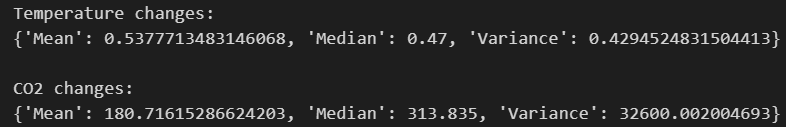
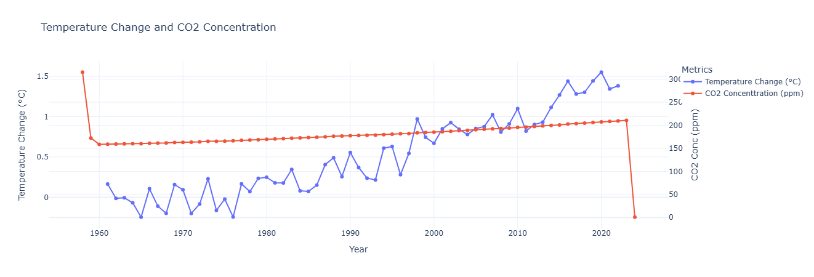

# 🌍 CO₂ Concentration and Global Temperature Analysis

## 📌 Project Overview

This project analyzes the relationship between atmospheric **CO₂ concentrations** and **global temperature changes** using statistical analysis and data visualization techniques. The goal is to understand long-term trends, correlations, and the potential impact of CO₂ variations on global warming.

The study combines descriptive statistics, time-series analysis, correlation analysis, regression modeling, clustering, and causality testing to provide a comprehensive view of how CO₂ levels and temperature anomalies are connected.

---

## 📊 Dataset Description

The dataset contains:

* **CO₂ concentration (ppm)** over time
* **Global temperature change (°C)** over the same period
The data spans multiple years, allowing both long-term trend analysis and seasonal pattern detection.

---

## 🔍 Methods Used

### 1. Descriptive Statistics

The mean temperature change is approximately 0.54°C, with a median of 0.47°C and a variance of 0.43, indicating slight variability in temperature anomalies. For CO₂ concentrations, the mean is 180.72 ppm, the median is significantly higher at 313.84 ppm, and the variance is 32,600, which reflects substantial variability in CO₂ levels over the dataset’s timeframe.

### 2. Time Series Analysis

* Line plots were used to observe how CO₂ levels and temperature anomalies evolve over time.
* Trend lines highlight long-term increases in both variables.

### 3. Correlation Analysis

* A correlation heatmap was used to measure the strength of association between CO₂ concentration and temperature change.

### 4. Scatter Plot Analysis

* Scatter plots visualize the direct relationship between CO₂ levels and temperature anomalies.

### 5. Regression Analysis (OLS)

* Ordinary Least Squares (OLS) regression was applied to quantify how much temperature change can be explained by CO₂ concentrations.

### 6. Granger Causality Test

* Used to test whether changes in CO₂ concentrations can predict temperature changes within specific time lags.

### 7. Clustering Analysis

* Clustering techniques were applied to group data points based on CO₂ and temperature patterns.

### 8. Scenario Analysis

* Simulated increases and reductions in CO₂ levels to estimate potential temperature impacts.

---

## 📈 Key Findings

### 🔹 Descriptive Statistics

* **Mean temperature change:** ~0.54 °C

* **Median temperature change:** ~0.47 °C

* **Temperature variance:** ~0.43

* **Mean CO₂ concentration:** ~180.72 ppm

* **Median CO₂ concentration:** ~313.84 ppm

* **CO₂ variance:** ~32,600

This shows relatively steady temperature changes but high variability in CO₂ levels over time.

---

### 🔹 Time-Series Trends

* CO₂ concentrations show a **consistent upward trend**, reflecting continuous accumulation of greenhouse gases.
* Global temperature change also shows an **upward trend**, supporting the global warming hypothesis.

---

### 🔹 Correlation Results

* **Correlation coefficient ≈ 0.96**, indicating a **very strong positive relationship** between CO₂ levels and temperature change.

---

### 🔹 Scatter Plot Insights

* A clear **linear relationship** is visible: higher CO₂ concentrations correspond to higher temperature anomalies.

---

### 🔹 Trend Line Comparison

* CO₂ trend slope: **0.32**
* Temperature trend slope: **0.03**

This indicates that CO₂ levels are increasing much faster than temperature, but temperature effects accumulate steadily over time.

---

### 🔹 Seasonal CO₂ Patterns

* CO₂ levels **peak in late spring/early summer (around May)**.
* CO₂ levels are **lowest in early fall (around September)**.

These fluctuations are linked to **natural carbon sinks**, such as plant photosynthesis and respiration.

---

### 🔹 Regression Analysis (OLS)

* **R-squared: 0.949**
  → 94.9% of the variation in temperature change is explained by CO₂ concentration.
* **CO₂ coefficient: 0.3245 (p < 0.05)**
  → Indicates a statistically significant positive relationship.

---

### 🔹 Granger Causality Test

* While correlation is very strong, Granger causality tests **do not provide strong evidence** that CO₂ changes directly cause temperature changes within the tested time lags.

---

### 🔹 Clustering Results

* Data clusters progress from **lower CO₂ & lower temperature** to **higher CO₂ & higher temperature**.
* This visually reinforces the relationship between greenhouse gas concentration and warming.

---

### 🔹 Scenario Analysis

* **10% increase in CO₂** → noticeable rise in temperature anomalies.
* **10–20% reduction in CO₂** → potential cooling effects and partial reversal of warming trends.

This highlights the **sensitivity of global temperatures** to CO₂ levels.

---

## ✅ Conclusion

* CO₂ concentrations and global temperature changes are **strongly and positively correlated**.
* Statistical modeling shows CO₂ is a major explanatory factor for temperature anomalies.
* Although short-term causality is not strongly supported, long-term trends and regression results clearly indicate CO₂’s critical role in global warming.
* Reducing CO₂ emissions could have **meaningful long-term climate benefits**.

---

## 🛠️ Tools & Techniques

* Python (NumPy, Pandas, Matplotlib/Seaborn, Statsmodels)
* Time-series analysis
* Correlation & regression modeling
* Clustering techniques

---

## 📌 Future Work

* Incorporate additional climate variables (methane, aerosols, ocean temperature).
* Use non-linear and lag-aware models.
* Extend causality analysis with longer lag windows.

---

If you want, I can also:

* Rewrite this in a **shorter README**
* Add a **folder structure section**
* Add **code snippets & plots references**
* Make it sound more **academic or more beginner-friendly**

Just tell me 👍
